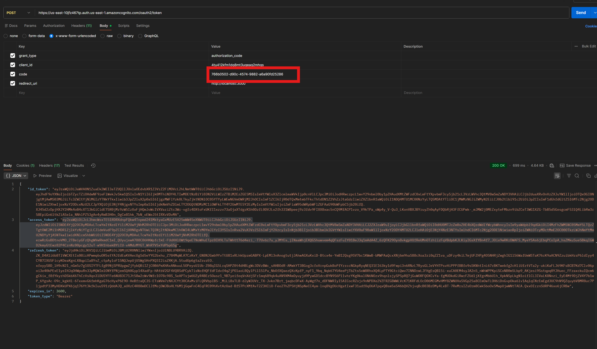

# 🚗 Revenda de Veículos - Sistema de Gestão

[](https://github.com/yudi19/revenda-veiculos-postech/actions/workflows/deploy.yml)
[](https://sonarcloud.io/summary/new_code?id=yudi19key)

Sistema de gestão para revenda de veículos desenvolvido com JAVA 21, Spring Boot, implementando arquitetura hexagonal. O projeto possui integração completa com **AWS Cognito para autenticação**, deploy automatizado na AWS EC2 via GitHub Actions, e análise contínua de qualidade de código com SonarCloud.

## 📋 Sumário

- [Sobre o Projeto](#-sobre-o-projeto)
- [Arquitetura](#-arquitetura)
- [Tecnologias](#-tecnologias)
- [Pré-requisitos](#-pré-requisitos)
- [Instalação e Execução](#-instalação-e-execução)
  - [Executando Localmente](#executando-localmente)
  - [Executando com Docker](#executando-com-docker)
- [Documentação da API](#-documentação-da-api)
- [Testes](#-testes)
- [CI/CD](#-cicd)
- [Infraestrutura](#-infraestrutura)

## 🎯 Sobre o Projeto

O sistema de revenda de veículos permite gerenciar o catálogo de veículos disponíveis e realizar vendas com controle de usuários autenticados via AWS Cognito. A aplicação foi desenvolvida como projeto acadêmico para a Pós-Tech FIAP, demonstrando boas práticas de engenharia de software.

### Funcionalidades Principais

- ✅ Cadastro, edição e listagem de veículos ordenados por valor
- ✅ Venda de veiculos para usuários cadastrados
- ✅ Autenticação e autorização com AWS Cognito
- ✅ Listagem de vendas ordenadas por valor
- ✅ Persistência em banco de dados H2 (desenvolvimento) / configurável para produção
- ✅ Autenticação e autorização com JWT
- ✅ Deploy automatizado na AWS

## 🏗 Arquitetura

O projeto segue os princípios da Arquitetura Hexagonal, separando responsabilidades em camadas bem definidas:

```
src/main/java/com/example/revenda_veiculos_postech/
├── adapters/                    # Camada de Adaptadores
│   └── in/
│       └── web/                 # Controllers REST
├── application/                 # Camada de Aplicação
│   ├── dto/                     # Data Transfer Objects
│   └── usecase/                 # Casos de Uso
├── domain/                      # Camada de Domínio
│   ├── model/                   # Entidades de Negócio
│   └── port/                    # Interfaces (Portas)
└── infrastructure/              # Camada de Infraestrutura
    ├── config/                  # Configurações
    ├── mapper/                  # Mapeadores Entity ↔ Domain
    ├── persistence/             # Implementação JPA
    └── security/                # Segurança e Auth
```

### Camadas

- **Domain**: Contém as regras de negócio puras (Veiculo, Venda) e portas (interfaces)
- **Application**: Casos de uso que orquestram a lógica de negócio
- **Adapters**: Implementações de entrada (Controllers) e saída (Repositories)
- **Infrastructure**: Configurações técnicas (Spring, Security, JPA)

## 🛠 Tecnologias

- **Java 21** - Linguagem de programação
- **Spring Boot 3.3.4** - Framework principal
- **Spring Security** - Autenticação e autorização
- **Spring Data JPA** - Persistência de dados
- **H2 Database** - Banco de dados em memória (desenvolvimento)
- **AWS Cognito** - Autenticação de usuários
- **Gradle** - Gerenciamento de dependências e build
- **Docker** - Containerização
- **GitHub Actions** - CI/CD
- **Terraform** - Infraestrutura como código
- **SonarCloud** - Análise de qualidade de código
- **JaCoCo** - Cobertura de testes
- **Lombok** - Redução de boilerplate

## 📦 Pré-requisitos

- **Java 21** ou superior
- **Gradle 8.5+** (ou use o wrapper incluído)
- **Docker** e **Docker Compose** (opcional)
- **Git**
- **AWS Cognito** configurado (para autenticação em endpoints protegidos)

## 🚀 Instalação e Execução

### Executando Localmente

1. **Clone o repositório:**
```bash
git clone https://github.com/yudi19/revenda-veiculos-postech.git
cd revenda-veiculos-postech
```


### Executando com Docker

#### Usando Docker Compose (recomendado)

1. **Construa e inicie os containers:**
```bash
docker-compose up --build
```

2. **Acesse a aplicação:**
   - API: http://localhost:8080

3. **Para parar os containers:**
```bash
docker-compose down
```

#### Collections 
  - Collections postman esta na pasta /collections

#### Cadastro de usuário via cognito e geração de JWT
  - Para testar o cadastro e autenticação via cognito, acesse https://us-east-10jfz467tp.auth.us-east-1.amazoncognito.com/login?client_id=4tu412kfm1dq8mt3ugeag2mhgs&response_type=code&scope=email+openid&redirect_uri=http%3A%2F%2Flocalhost%3A3000 

  - Após o cadastro e o login copiar o atributo code da url e colar no body da requisição da request /login:
  

## 📚 Documentação da API

### Base URL
```
Local: http://localhost:8080
```

### Autenticação

Endpoints protegidos requerem um token JWT válido do AWS Cognito no header:
```
Authorization: Bearer {seu-token-jwt}
```

Endpoints públicos (não requerem autenticação):
- `GET /veiculos` - Listar veículos
- `GET /vendas` - Listar vendas
- `GET /actuator/health` - Status da aplicação

---

### 🚙 Endpoints de Veículos

#### 1. Listar Todos os Veículos

```http
GET /veiculos
```

**Resposta de Sucesso (200 OK):**
```json
[
  {
    "id": 1,
    "marca": "Toyota",
    "modelo": "Corolla",
    "ano": 2023,
    "cor": "Prata",
    "preco": 125000.00
  },
  {
    "id": 2,
    "marca": "Honda",
    "modelo": "Civic",
    "ano": 2024,
    "cor": "Preto",
    "preco": 135000.00
  }
]
```

#### 2. Cadastrar Novo Veículo

```http
POST /veiculos
Content-Type: application/json
Authorization: Bearer {token}
```

**Corpo da Requisição:**
```json
{
  "marca": "Volkswagen",
  "modelo": "Jetta",
  "ano": 2024,
  "cor": "Branco",
  "preco": 115000.00
}
```

**Validações:**
- `marca`: obrigatório, não pode ser vazio
- `modelo`: obrigatório, não pode ser vazio
- `ano`: obrigatório
- `cor`: obrigatório, não pode ser vazio
- `preco`: obrigatório, deve ser > 0

**Resposta de Sucesso (200 OK):**
```json
{
  "id": 3,
  "marca": "Volkswagen",
  "modelo": "Jetta",
  "ano": 2024,
  "cor": "Branco",
  "preco": 115000.00
}
```

**Resposta de Erro (400 Bad Request):**
```json
{
  "timestamp": "2025-12-27T18:30:00.000+00:00",
  "status": 400,
  "error": "Bad Request",
  "message": "Validation failed",
  "errors": [
    {
      "field": "preco",
      "message": "must be greater than 0"
    }
  ]
}
```

#### 3. Editar Veículo Existente

```http
PUT /veiculos/{id}
Content-Type: application/json
Authorization: Bearer {token}
```

**Parâmetros de URL:**
- `id`: ID do veículo a ser editado

**Corpo da Requisição:**
```json
{
  "marca": "Volkswagen",
  "modelo": "Jetta GLI",
  "ano": 2024,
  "cor": "Vermelho",
  "preco": 145000.00
}
```

**Resposta de Sucesso (200 OK):**
```json
{
  "id": 3,
  "marca": "Volkswagen",
  "modelo": "Jetta GLI",
  "ano": 2024,
  "cor": "Vermelho",
  "preco": 145000.00
}
```

**Resposta de Erro (404 Not Found):**
```json
{
  "timestamp": "2025-12-27T18:30:00.000+00:00",
  "status": 404,
  "error": "Not Found",
  "message": "Veículo não encontrado"
}
```

---

### 💰 Endpoints de Vendas

#### 1. Listar Todas as Vendas

Lista todas as vendas realizadas, ordenadas por valor (do menor para o maior), com informações detalhadas do veículo vendido.

```http
GET /vendas
```

**Resposta de Sucesso (200 OK):**
```json
[
  {
    "id": 1,
    "userCognito": "usuario@email.com",
    "valorVenda": 115000.00,
    "dataVenda": "2025-12-27T15:30:00",
    "veiculo": {
      "id": 3,
      "marca": "Volkswagen",
      "modelo": "Jetta",
      "ano": 2024,
      "cor": "Branco",
      "preco": 115000.00
    }
  },
  {
    "id": 2,
    "userCognito": "comprador@email.com",
    "valorVenda": 125000.00,
    "dataVenda": "2025-12-27T16:45:00",
    "veiculo": {
      "id": 1,
      "marca": "Toyota",
      "modelo": "Corolla",
      "ano": 2023,
      "cor": "Prata",
      "preco": 125000.00
    }
  }
]
```

#### 2. Realizar uma Venda

Registra a venda de um veículo. O usuário autenticado é automaticamente vinculado à venda.

```http
POST /vendas
Content-Type: application/json
Authorization: Bearer {token}
```

**Corpo da Requisição:**
```json
{
  "veiculoId": 1
}
```

**Validações:**
- `veiculoId`: obrigatório, deve existir no sistema
- Usuário deve estar autenticado (token JWT válido)

**Resposta de Sucesso (200 OK):**
```json
{
  "id": 1,
  "veiculoId": 1,
  "userCognito": "usuario@email.com",
  "valorVenda": 125000.00,
  "dataVenda": "2025-12-27T15:30:00"
}
```

**Resposta de Erro (401 Unauthorized):**
```json
{
  "timestamp": "2025-12-27T18:30:00.000+00:00",
  "status": 401,
  "error": "Unauthorized",
  "message": "Token JWT inválido ou expirado"
}
```

**Resposta de Erro (400 Bad Request):**
```json
{
  "timestamp": "2025-12-27T18:30:00.000+00:00",
  "status": 400,
  "error": "Bad Request",
  "message": "Veículo não encontrado"
}
```

---

### 🏥 Health Check

```http
GET /actuator/health
```

**Resposta de Sucesso (200 OK):**
```json
{
  "status": "UP"
}
```

---

### Exemplos com cURL

**Listar veículos:**
```bash
curl -X GET http://localhost:8080/veiculos
```

**Cadastrar veículo (requer autenticação):**
```bash
curl -X POST http://localhost:8080/veiculos \
  -H "Content-Type: application/json" \
  -H "Authorization: Bearer SEU_TOKEN_JWT" \
  -d '{
    "marca": "Ford",
    "modelo": "Mustang",
    "ano": 2024,
    "cor": "Azul",
    "preco": 350000.00
  }'
```

**Realizar venda (requer autenticação):**
```bash
curl -X POST http://localhost:8080/vendas \
  -H "Content-Type: application/json" \
  -H "Authorization: Bearer SEU_TOKEN_JWT" \
  -d '{
    "veiculoId": 1
  }'
```

**Listar vendas:**
```bash
curl -X GET http://localhost:8080/vendas
```


## 🔄 CI/CD

O projeto possui pipeline completo de CI/CD implementado com GitHub Actions:

### Pipeline Quality (Qualidade)
- ✅ Execução de testes automatizados
- ✅ Geração de relatório de cobertura (JaCoCo)
- ✅ Análise estática de código (SonarCloud)
- ✅ Validação de quality gates

### Pipeline Deploy
- ✅ Build da aplicação com Gradle
- ✅ Geração do artefato JAR
- ✅ Deploy automático na AWS EC2
- ✅ Restart inteligente da aplicação
- ✅ Health check pós-deploy

### Workflows Disponíveis

1. **deploy.yml** - Pipeline principal (executa no push para `main`)
2. **auto-pr.yml** - Criação automática de Pull Requests (requer `PAT_TOKEN`)

Para ativar o workflow de PRs automáticos, configure um Personal Access Token:
1. Acesse: https://github.com/settings/tokens
2. Gere um token com escopo `repo`
3. Adicione como secret `PAT_TOKEN` no repositório

## ☁️ Infraestrutura

### Arquitetura AWS

```
┌─────────────────┐
│  GitHub Actions │
└────────┬────────┘
         │ (SSH/SCP)
         ▼
┌─────────────────────────────┐
│      AWS EC2 Instance       │
│   (t4g.micro - ARM64)       │
│                             │
│  ┌──────────────────────┐  │
│  │  Java 21 Application │  │
│  │  Port: 8080          │  │
│  └──────────────────────┘  │
│                             │
└─────────────────────────────┘
         ▲
         │
┌────────┴─────────┐
│   AWS Cognito    │
│  (Autenticação)  │
└──────────────────┘
```


## 📄 Licença

Este projeto foi desenvolvido como trabalho acadêmico para a Pós-Tech FIAP.

## 👥 Autores

- **Yudi** - [@yudi19](https://github.com/yudi19)

